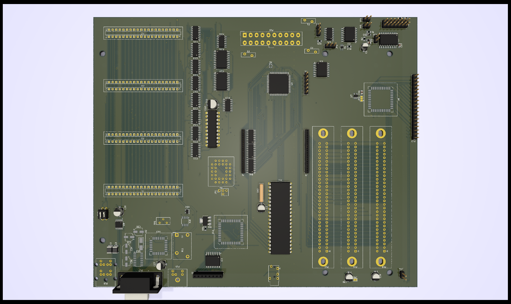

# Dragon 256 rev X4 Kitchen Sink Edition #

This repository contains the hardware design
for a heavily revised Dragon 32 computer
main board. Unlike my other designs this does
not conform to the original footprint and port
placement.

The design is most definitely experimental
and absolutely unproven

## Features ##

The board differs from standard with the
following features:

* 256k SRAM - 64k address space, 32k pages
(lower and upper ram space)
* Multiple (selectable) cartridge slots
* 2 button joystick ports (compatible with
original single button joysticks)
* Hardware serial port (as with Dragon 64)
* Switchable ROM banks (as with Dragon 64)
* Twin AY-sound generators (6 channels)
* SAM X4
* Advanced, addressable 6847 compatible VDG
(one of different video output options)
* Fast CPU options (1.8 or 3.6 MHz)

## Board Layout ##

The regular interface ports are kept to the
left hand side of the board although the
serial port is a more commonly accepted DE9
configuration instead of the 7-pin DIN

The rear of the board is dedicated to the 
cartridge slots. The power and video output
is on the right of the board.

The board itself should (just) fit inside a 
regular Dragon case but the power and video 
interface needs to be external. The mounting 
points are all wrong but it should fit.

The design is intended to fit within an ATX
case and conforms to the smallest ATX standard
so almost any ATX case should suffice with a
single caveat - the cartridge ports may
overlap the space given over to the power supply,
especially on older designs. A modern case 
design that places the power supply away from 
the board (typically the bottom of the case)
should have no problems.

The keyboard connector is compatible with the
original Dragon design but also includes an 
extra +5V which makes it very convenient to 
fit an adapter for other styles of keyboard 
using a microcontroller.

## Progress ##

The design integrates most of the designs and
upgrades I've developed for the Dragon, all 
into a single board which helps to reduce the 
footprint and power requirements

At this point the task is to play around with
the component layout to find a relatively simple
and efficient approach. The board size, port 
positions and component layout has not been 
fixed. The only exception to this is the three 
video connectors - these can be moved around the
board but must retain the same relative 
positions

### Custom SamX4 Design ###

The samX4 VHDL requires modifying to suit the 
new design. Some features can be removed (like
support for 4k and 16k memory models and DRAM
refresh) and others points need adding 
(corrected VDG read/clk timing and faster CPU
multiplier).

### PIA Port Disambiguation ###

The original SAM memory map provides three
address blocks for interfacing with PIAs.
Noted as P0, P1 and P2, these are 32 bytes
each but the 6821 PIA only recognises a
4 byte range so the 32 byte block is 8
repeats of the PIAs 4 bytes.

The board design here splits P1 into 8
distinct blocks within the 32 byte range
thus allowing for much more complexity in
what the CPU can address. The devices are
noted as P1a - P1h.

P0 is left as-is (for now). P2 is the
responsibility of the cartridge port but
the same disambiguation can easily be
applied on a per-cartridge basis.

The upper half of the expanded P1 device 
range is dedicated to the 256k banking
scheme.

P1a is the original PIA (to retain
compatibility), P1b is assigned to the
VDG, P1c and P1d are the AY sound generators.

### SamX4 Timing ###

The default operation of the SAM chip
provides a synchronised Q/E quadrature clock
for the CPU and VDG. The two devices operate
on opposite phases of the same clock.

In order to retain a viable video signal
the VDG timing must operate at the default
0.89MHz frequency (VCLK is double that
speed at 1.8MHz). Doubling the CPU clock 
would result in the video signal being
disrupted as it tries to run at double the
usual rate. Note that the VDG does not need
to see the E signal, instead it relies on
the RAS0 signal to capture valid data over a
74LS273 to buffer and stabilise the bus.

To maintain a viable video signal the video
clock needs to kept at the original rate, so
the E signal witnessed by the VDG needs to
be 0.89MHz and VCLK needs to be 1.8MHz. With
a custom SAM this is not too large a task
given the specific clock multipliers can be
customised.

The SAM in turn needs to capture the DA0
signal from the VDG to trigger the next
graphic data read.

Typically the VDG timing is nearly
interleaved with the CPU timing on a 1:1
basis. This is managed through synchronisation
of the VCLK and DA0.

If the CPU speed is doubled the interleaving
needs to be 2:1, and at quadruple speed it
would be 4:1.

Normally the VDG is exposed to data from
both parts of the timing phase but given
we don't need to send CPU data to the
VDG, the LS273 can be set to only expose
graphic data. The RAS0 signal used to
trigger a load on the LS273 is artificial
in nature given the memory is SRAM so no
RAS/CAS multiplexing is technically required.
In this context the RAS0 signal needs to
isolated from the "regular" RAS0 and then
timed to only fire at the original
0.89MHz.

The alternative to this is to use a block
of dual port memory that allows the VDG
to operate on a completely different
clock cycle to the CPU, severing the need
for the CPU to operate at a multiple of
the VDG speed. In this mode of operation
the SAM no longer needs to provide the
VCLK signal or prepare the RAS0 signal
and data. There are clear advantages to
this approach but it does add other
complexities and a 32k DPSRAM is not the
cheapest option (although two 16k DPSRAM
is likely to be *much* cheaper) or the
smallest given the need for twice as
many IO pins...

## Contributing ##

The project needs review and ultimately, 
testing, once the design progresses that far.

If you want to help please get in touch first 
to keep the work flow consistent and to avoid
potentially disasterous conflicts

Currently the project needs review of the
schematics prior to build, and a rewrite
of the samX4 VHDL and GAL16V8 logic that
drives the cartridge ports

## Design Notes ##

Fundamentally this board is a combination of
the revised Dragon 32 board (based on revX4)
and a Dragon specific version of the 4-slot
MPI design commonly used on Color Computers.

Barring the physical constraints of the 
original Dragon 32/64 case, all requirements
remain to maintain compatibility with 
existing software and hardware.

### Video Subsystem ###

As with the rev3 and revX4 boards the video
subsystem is removed from the main design
and all components moved to a daughterboard.
On the rev3 and revX4 boards this is a 
mezzanine board, here it is moved to an edge
connected board. It should be possible to
retain the same video boards with a simple
adapter. The video subsystem is restricted
to slot 1 due to the additional signals
required from PIA 1 (U11) for control of
graphic modes

### SAM ###

Instead of using the increasingly rare 
MC6883 SAM chip this board relies on a CPLD
to simulate the SAM chip. With no requirement
to support 4KB, 16KB, 32KB or 64KB, or DRAM
refresh a notable chunk of the functionality
is no longer needed. What remains is CPU and
video timing (see above), and memory 
multiplexing and routing.

The CPU/Video timing is expanded to permit
fast operation without losing video coherence.
The memory multiplexing is extended to 
include memory paging and banking with the
intent of achieving 2K or 4K page sizes
with support for two independent tasks.

The current scheme is limited to only 1MB of
paged RAM.

There is one additional requirement (as standard)
and that is to convert VDG read pulses into
a full address request. This needs the SAM
to maintain a video base address, to count
VDG read pulses (on rising and falling edge),
to repeat a "row" of data (reseting the 
video read address on HS), how many times a
row is repeated and to control how
many bytes are required for a single video
row (or more accurately how many bits of the
video address should be set to 0 on HS - this
will need improving in order to permit a 40
byte row instead of 32 or 16 bytes).

The original SAM registers are built out of
flip-flops mapped to a pair of addresses, one
for set, one for reset. Any write strobe of 
that address activating the latch as required.

The samX4 does not need to operate in this
manner but does so for compatibility.

The default address map for the SAM control 
bits is based at $FFC0

| Dec   | Hex  | Purpose |
| ----- | ---- | ------- |
| 65472 | FFC0 | Clear V0 |
| 65473 | FFC1 | Set V0 |
| 65474 | FFC2 | Clear V1 |
| 65475 | FFC3 | Set V1 |
| 65476 | FFC4 | Clear V2 |
| 65477 | FFC5 | Set V2 |
| 65478 | FFC6 | Clear D0 |
| 65479 | FFC7 | Set D0 |
| 65480 | FFC8 | Clear D1 |
| 65481 | FFC8 | Set D1 |
| 65482 | FFCA | Clear D2 |
| 65483 | FFCB | Set D2 |
| 65484 | FFCC | Clear D3 |
| 65485 | FFCD | Set D3 |
| 65486 | FFCE | Clear D4 |
| 65487 | FFCF | Set D4 |
| 65488 | FFD0 | Clear D5 |
| 65489 | FFD1 | Set D5 |
| 65490 | FFD2 | Clear D6 |
| 65491 | FFD3 | Set D6 |
| 65492 | FFD4 | Clear P1 |
| 65493 | FFD5 | Set P1 |
| 65494 | FFD6 | Clear R0 |
| 65495 | FFD7 | Set R0 |
| 65496 | FFD8 | Clear R1 |
| 65497 | FFD9 | Set R1 |
| 65498 | FFDA | Clear M0 |
| 65499 | FFDB | Set M0 |
| 65500 | FFDC | Clear M1 |
| 65501 | FFDD | Set M1 |
| 65502 | FFDE | Clear TY |
| 65503 | FFDF | Set TY |

V0-2 is the Video Address Mode and controls
how many rows are repeated and how many bits
are cleared on HS.

D0-6 is the Video Base Address offset by 512.

P1 is the default page mode and when set
maps the upper 32k of RAM to the lower 32k
(only useful in RAM/ROM mode).

R0-1 controls the CPU speed. The original
behaviour is relatively complex but for
the purposes of this design.

M0-1 changes the memory size (RAM), only
the value %11 (3) is valid here since the
smaller and dynamic memory sizes are
irrelevant and are all values are treated
the same.

TY changes the multiplexing mode between
RAM/ROM (upper 32K reserved for ROMS) and
all RAM. By default the system needs to boot
as RAM/ROM then copy the ROM into RAM (using
P1) to then switch to all RAM, or to only do
so on demand (as per Dragon 64).

With the samX4 it should be possible (slightly
dangerous) to accept a full byte value on a
write instead of requiring multiple writes to
set the full value. So a write of xxxxx101 to
$FFC0 would set all three bits.

The upper bits should behave as per normal.
The danger is that the data written to the bus
will be "garbage" since there was no prior
requirement so an additional pair of addresses
will be needed to control whether the fast
write is acceptable behaviour.

Proposed/Changed Registers:

| Dec   | Hex  | Purpose |
| ----- | ---- | ------- |
| 65472 | FFC0 | Clear V0-3 |
| 65473 | FFC1 | Set V0-3 to bus value |
| 65478 | FFC7 | Clear D0-7 |
| 65479 | FFC8 | Set D0-7 to bus value |
| 65494 | FFD6 | Clear R0-1 |
| 65495 | FFD7 | Set R0-1 to bus value |

__Note__:  
V register is expanded to 4 bits to cover 
wider rows.  
D register is expanded to 8 bits to naturally
extend the base address outside of the default
64K address space without the need for custom
rules for video in the paging scheme.  
The clear operations are largely redundant in
the revised scheme since the same can be
achieved by writing 0 to the _set_ address.

The behaviour of R is modified so that 0 is
the default 0.89MHz operation, 1 is the "safe"
address dependent fast mode, 2 is double
speed of 1.88MHz (requires a MC68B09 or HD6309), 
and 3 is quad speed of 3.57MHz (only possible 
with a HD63C09 CPU).

### Memory Subsystem ###

As with the video the system RAM is moved to
an independent board that abstracts operation
off the main board so that the three buses
behave as per the original Dragon Data design.

For paging there are two commonly "reserved"
memory spaces for this use - $FF90-$FF91 and
$FFA0-$FFAF. A total of 18 bytes. This space
conflicts with "The Dragon's Claw" cartridge
although that can be managed with jumpers on 
to move the address of the cartridge to $FFB0.

It should be safe to expand the available
address mapping to $FF80-$FFAF providing 48
bytes of address space.

#### Address Bus ####

The address bus is expanded to a potential 24
bit width - enough to support a 16MB address
space (4MB on board and 3 expansion blocks).

The SAM is responsible (as always) for routing
16bit requests to the 24bit address space.

#### Data Bus Arbitration ####

The original design requires that the CPU
data bus be isolated from video data reads.
Likewise the video subsystem should only be
exposed to data reads. The original specification
allowed CPU and video reads to be exposed to
the VDG but for fast operation this is refined
to only allow video reads to hit the VDG and
for that data to be maintained for a full
VDG read cycle, which may be 1, 2 or 4 times
the length of a CPU clock cycle depending on
CPU clock speed.

Other than the VDG all other data driven
components on the board are permanently
connected to the data and address buses.

It is the responsibility of the memory board
to provide data on both data buses and
control when the data is exposed on read
operations.
