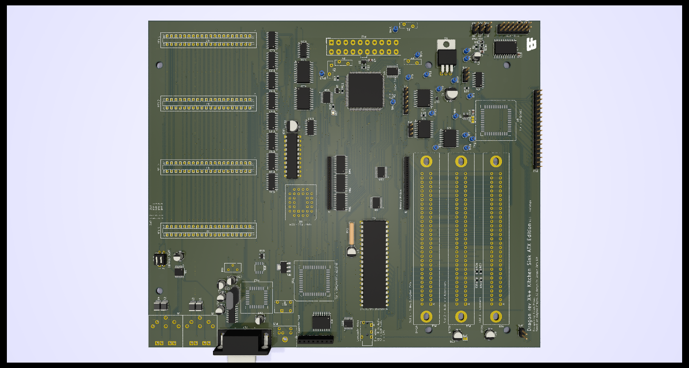

# Dragon 256 rev X4 Kitchen Sink Edition #

This repository contains the hardware design
for a heavily revised Dragon 32 computer
main board. Unlike my other designs this does
not conform to the original footprint and port
placement.

The design is most definitely experimental
and absolutely unproven

## Features ##

The board differs from standard with the
following features:

* 256k SRAM - 64k address space, 32k pages
(lower and upper ram space)
* Multiple (selectable) cartridge slots
* 2 button joystick ports (compatible with
original single button joysticks)
* Hardware serial port (as with Dragon 64)
* Switchable ROM banks (as with Dragon 64)
* Twin AY-sound generators (6 channels)
* SAM X4
* Advanced, addressable 6847 compatible VDG
(one of different video output options)
* Fast CPU options (1.8 or 3.6 MHz)

## Board Layout ##

The regular interface ports are kept to the
left hand side of the board although the
serial port is a more commonly accepted DE9
configuration instead of the 7-pin DIN

The rear of the board is dedicated to the 
cartridge slots. The power and video output
is on the right of the board.

The board itself should (just) fit inside a 
regular Dragon case but the power and video 
interface needs to be external. The mounting 
points are all wrong but it should fit.

The design is intended to fit within an ATX
case and conforms to the smallest ATX standard
so almost any ATX case should suffice with a
single caveat - the cartridge ports may
overlap the space given over to the power supply,
especially on older designs. A modern case 
design that places the power supply away from 
the board (typically the bottom of the case)
should have no problems.

The keyboard connector is compatible with the
original Dragon design but also includes an 
extra +5V which makes it very convenient to 
fit an adapter for other styles of keyboard 
using a microcontroller.

## Progress ##

The design integrates most of the designs and
upgrades I've developed for the Dragon, all 
into a single board which helps to reduce the 
footprint and power requirements

At this point the task is to play around with
the component layout to find a relatively simple
and efficient approach. The board size, port 
positions and component layout has not been 
fixed. The only exception to this is the three 
video connectors - these can be moved around the
board but must retain the same relative 
positions

### Custom SamX4 Design ###

The samX4 VHDL requires modifying to suit the 
new design. Some features can be removed (like
support for 4k and 16k memory models and DRAM
refresh) and others points need adding 
(corrected VDG read/clk timing and faster CPU
multiplier).

### PIA Port Disambiguation ###

The original SAM memory map provides three
address blocks for interfacing with PIAs.
Noted as P0, P1 and P2, these are 32 bytes
each but the 6821 PIA only recognises a
4 byte range so the 32 byte block is 8
repeats of the PIAs 4 bytes.

The board design here splits P1 into 8
distinct blocks within the 32 byte range
thus allowing for much more complexity in
what the CPU can address. The devices are
noted as P1a - P1h.

P0 is left as-is (for now). P2 is the
responsibility of the cartridge port but
the same disambiguation can easily be
applied on a per-cartridge basis.

The upper half of the expanded P1 device 
range is dedicated to the 256k banking
scheme.

P1a is the original PIA (to retain
compatibility), P1b is assigned to the
VDG, P1c and P1d are the AY sound generators.

### SamX4 Timing ###

The default operation of the SAM chip
provides a synchronised Q/E quadrature clock
for the CPU and VDG. The two devices operate
on opposite phases of the same clock.

In order to retain a viable video signal
the VDG timing must operate at the default
0.89MHz frequency (VCLK is double that
speed at 1.8MHz). Doubling the CPU clock 
would result in the video signal being
disrupted as it tries to run at double the
usual rate. Note that the VDG does not need
to see the E signal, instead it relies on
the RAS0 signal to capture valid data over a
74LS273 to buffer and stabilise the bus.

To maintain a viable video signal the video
clock needs to kept at the original rate, so
the E signal witnessed by the VDG needs to
be 0.89MHz and VCLK needs to be 1.8MHz. With
a custom SAM this is not too large a task
given the specific clock multipliers can be
customised.

The SAM in turn needs to capture the DA0
signal from the VDG to trigger the next
graphic data read.

Typically the VDG timing is nearly
interleaved with the CPU timing on a 1:1
basis. This is managed through synchronisation
of the VCLK and DA0.

If the CPU speed is doubled the interleaving
needs to be 2:1, and at quadruple speed it
would be 4:1.

Normally the VDG is exposed to data from
both parts of the timing phase but given
we don't need to send CPU data to the
VDG, the LS273 can be set to only expose
graphic data. The RAS0 signal used to
trigger a load on the LS273 is artificial
in nature given the memory is SRAM so no
RAS/CAS multiplexing is technically required.
In this context the RAS0 signal needs to
isolated from the "regular" RAS0 and then
timed to only fire at the original
0.89MHz.

The alternative to this is to use a block
of dual port memory that allows the VDG
to operate on a completely different
clock cycle to the CPU, severing the need
for the CPU to operate at a multiple of
the VDG speed. In this mode of operation
the SAM no longer needs to provide the
VCLK signal or prepare the RAS0 signal
and data. There are clear advantages to
this approach but it does add other
complexities and a 32k DPSRAM is not the
cheapest option (although two 16k DPSRAM
is likely to be *much* cheaper) or the
smallest given the need for twice as
many IO pins...

## Contributing ##

The project needs review and ultimately, 
testing, once the design progresses that far.

If you want to help please get in touch first 
to keep the work flow consistent and to avoid
potentially disasterous conflicts

Currently the project needs review of the
schematics prior to build, and a rewrite
of the samX4 VHDL and GAL16V8 logic that
drives the cartridge ports